<div align="center">

<a href="https://nebulatris.co/">

</a>

<br />

*An open, living tracker for blog topics, feedback, and questions —*
*every issue here is a thread on the blog's roadmap.*

<br />

[](https://github.com/NebulaTris/my-eng-blog-suggestions/issues)
[](https://nebulatris.co/)
[](https://github.com/NebulaTris/my-eng-blog-suggestions/issues/new/choose)
[](https://nebulatris.co/about)

<br />

[**Suggest a topic**](https://github.com/NebulaTris/my-eng-blog-suggestions/issues/new?template=idea_request.yml) ·
[**Give feedback**](https://github.com/NebulaTris/my-eng-blog-suggestions/issues/new?template=feedback.yml) ·
[**Ask a question**](https://github.com/NebulaTris/my-eng-blog-suggestions/issues/new?template=question.yml) ·
[**Read the blog →**](https://nebulatris.co/)


</div>

## What this repo is

This is **not a code repository.** It is a public-facing inbox for
[nebulatris.co](https://nebulatris.co/) — an engineering blog by
[Shambhavi (@NebulaTris)](https://github.com/NebulaTris) that goes
deep on computer science, system design, LLM engineering, and
agentic AI, in the spirit of *Pudding.cool*-style data storytelling.

Every issue you open here flows directly into the blog's editorial
pipeline. Think of it as a **shared whiteboard** between the readers
and the writer.

> &nbsp;&nbsp;_If you've ever thought:_
> &nbsp;&nbsp;_"this topic would make a great deep-dive,"_
> &nbsp;&nbsp;_"this post could be clearer,"_
> &nbsp;&nbsp;_or "I didn't fully understand this part" —_
> &nbsp;&nbsp;**this is the place to say it.**

<div align="center"></div>

## Live tracker — wired into the blog

<table>
<tr>
<td width="62%" valign="middle">

This is what makes this repository different from a generic
"suggestions" inbox: **every open issue is rendered live on the
blog itself.**

```
  issue opened here  ──►  GitHub Issues API  ──►  nebulatris.co/roadmap
        │                                                  │
        └────────── label & status sync both ways ─────────┘
```

The blog reads this repository through the public GitHub Issues API
and surfaces it as a live, filterable roadmap — so readers can:

|  | Behaviour on the blog |
| :-- | :-- |
| 💡 **Ideas** | Show up as cards in the "Up next" board, sorted by upvotes (👍 reactions). |
| 🐛 **Feedback** | Threaded under the post it references, visible to other readers. |
| ❓ **Questions** | Aggregated into a public Q&A column — answered questions become micro-posts. |
| ✅ **Closed** | Linked to the published post that resolved them — closing the loop. |

No accounts, no analytics, no third-party services. Just a
transparent, scrollable record of what's been asked, what's
in flight, and what shipped.

</td>
<td width="38%" valign="middle" align="center">



<sub><i>an idea, with its tags<br/>quietly in orbit around it</i></sub>

</td>
</tr>
</table>

<div align="center"></div>

## How to contribute

There are three issue templates. Pick the one that fits — or open a
blank issue if none of them feel right.

<table>
<tr>
<td width="33%" valign="top">

### 💡 Suggest a topic

Have an idea for a deep-dive, an animation, or a concept that's
*never explained well anywhere else?*

Tell me what should be covered, where the confusion usually lives,
and (if you have one) how it could be visualised.

→ [**Open a Blog Idea**](https://github.com/NebulaTris/my-eng-blog-suggestions/issues/new?template=idea_request.yml)

</td>
<td width="33%" valign="top">

### 🐛 Give feedback

Spotted something confusing, broken, or just plain wrong on a
published post? Want a better diagram, a clearer paragraph, a
working dark-mode toggle?

Link the post, describe what tripped you up, and suggest a fix.

→ [**Open Feedback**](https://github.com/NebulaTris/my-eng-blog-suggestions/issues/new?template=feedback.yml)

</td>
<td width="33%" valign="top">

### ❓ Ask a question

Something didn't click? You're probably not alone. Ask it openly —
the answer often becomes its own short post.

Be specific about *which* part lost you and what you tried first.

→ [**Ask a Question**](https://github.com/NebulaTris/my-eng-blog-suggestions/issues/new?template=question.yml)

</td>
</tr>
</table>

<div align="center"></div>

## What the blog covers

The blog is organised into four pillars. The most useful suggestions
fit one of these — but cross-pillar ideas are welcome too.

| Pillar | What lives there |
| :-- | :-- |
| 🟡 **Computer Science** | Foundations done properly: algorithms, data structures, OS internals, networking, theory. |
| 🟣 **System Design** | How real-world systems actually work — caching, queues, consistency, scale, tradeoffs. |
| 🟢 **LLM Engineering** | Inference, fine-tuning, RAG, evals, latency, cost — the engineering reality of language models. |
| 🟠 **Agentic AI** | Planning, tool use, memory, orchestration, and the unsolved problems of getting agents to *actually* do things. |

The house style is *deeply explained, visually told.* If a topic
can be turned into an interactive D3 chart, a scroll-driven
animation, or a Three.js scene that makes the idea click — that's
the goal.

<div align="center"></div>

## Issue lifecycle

Every issue moves through these states, driven entirely by labels.
The blog mirrors them in real time — watch a coral pulse travel the
track below; that's exactly how an idea moves on the live roadmap.

<div align="center">

</div>

Issues that don't fit the blog's scope are closed politely with a
short note explaining why — never silently. **Closed ≠ ignored.**

<div align="center"></div>

## Labels

Labels are how the blog filters the live tracker — each one maps to
a column, badge, or filter on `nebulatris.co/roadmap`. Don't worry
about applying them yourself; they're added during triage.

### Type — *what kind of issue is this?*

| Label | Meaning |
| :-- | :-- |
| `idea` 💡 | New blog topic or concept suggestion from the community. |
| `feedback` 🐛 | Improvements, corrections, or suggestions for existing blog content. |
| `question` ❓ | Clarifications or doubts about blog topics or concepts. |

### Status — *where in the pipeline is it?*

| Label | Meaning |
| :-- | :-- |
| `brainstorming` 🧠 | Early-stage ideas that need exploration or refinement. |
| `planned` 📌 | Selected ideas that are scheduled to be worked on. |
| `in-progress` ⚙️ | Blog or feature currently being developed. |
| `published` ✅ | Completed idea that has been turned into a live blog post. |

### Signal — *flags that change priority or treatment*

| Label | Meaning |
| :-- | :-- |
| `high-priority` 🔥 | Important ideas or issues that should be addressed soon. |
| `visual-heavy` 🎨 | Ideas that require strong visual storytelling or interactive elements. |

<div align="center"></div>

## Contribution philosophy

There are no bad questions and no bad ideas. A throwaway "wait, why
does TCP do *that*?" has more than once turned into a 3,000-word
animated post. If something nags at you, write it down here.

A few small things that help me write better posts:

* **Be specific.** "RAG is confusing" is hard to act on. "I don't
  understand why hybrid search outperforms pure vector at small
  corpora" is a post.
* **Link prior art.** If you've already read three explainers and
  they didn't land — tell me why. That gap is the post.
* **Don't worry about phrasing.** Half-formed thoughts are fine.
  Triage will sort it out.

## Code of conduct

Be kind, be curious, attack ideas not people. Disrespectful,
discriminatory, or hostile comments will be removed and the
account blocked. This is a small public space — keep it good.

## About the blog

[**nebulatris.co**](https://nebulatris.co/) is an engineering blog
by [Shambhavi (@NebulaTris)](https://github.com/NebulaTris), built
with Astro, TypeScript, GSAP, D3, and Three.js. Every post is open
in spirit: the writing is shaped by the issues in *this* repository,
and the roadmap is whatever conversation is happening here.

<div align="center">


<br />

**Thanks for being part of it.** ✨

[nebulatris.co](https://nebulatris.co/) · [@NebulaTris](https://github.com/NebulaTris)

</div>
